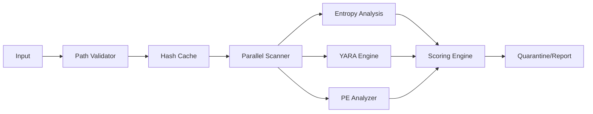

<div align="center">

#  HeapSec Antivirus

**Scanner antivírus local por análise estática**  
*Java 11+ • Scripts Shell • Zero dependências*

[](https://openjdk.org/)
[](LICENSE)
[]()

[ Instalação](#instalação) • [🚀 Uso](#uso) • [ Arquitetura](#arquitetura) • [ Performance](#performance) • [ Disclaimer](#%EF%B8%8F-aviso-legal)

</div>

---

##  Visão Geral

HeapSec é um scanner antivírus 100% local projetado para análise estática de alta performance em ambientes Linux. Desenvolvido como projeto de pesquisa em segurança ofensiva/defensiva, 
implementa técnicas avançadas de detecção heurística sem dependência de cloud ou APIs externas.

**Diferenciais técnicos:**
-  **Múltiplos motores de análise**: Entropia Shannon, pattern matching Aho-Corasick, parsing PE nativo
-  **Alta performance**: Processamento paralelo com ForkJoinPool
-  **Segurança defensiva**: Validação rigorosa de paths, proteção contra symlink attacks e zip bombs
-  **Zero dependências externas**: Funciona offline, sem banco de dados em cloud

---

## Arquitetura Técnica

### Stack e Decisões de Design



**Por que Java sem dependências?**
- **Zero setup**: Apenas Java 11+ (qualquer JVM serve)
- **Portável**: Funciona em qualquer Linux com Java
- **Simples**: Scripts shell para compilar e rodar
- **Offline**: Não requer internet nem cloud

### Componentes Core

| Módulo | Tecnologia | Função |
|--------|------------|---------|
| `EntropyAnalyzer` | Shannon Entropy | Detecta packing/criptografia (>7.8 entropy) |
| `YaraScanner` | Aho-Corasick O(n) | Matching de 60+ padrões comportamentais |
| `PEAnalyzer` | Custom PE Parser | Análise de seções suspeitas (Write+Execute, nomes anômalos) |
| `HashCache` | ConcurrentHashMap | Cache thread-safe com TTL e validação de integridade |
| `PathValidator` | Canonical Path + Symlink check | Proteção contra path traversal e symlink attacks |

---

## Instalação em 5 segundos

### Pré-requisitos
- Java 11+ (OpenJDK, Azul Zulu, etc)
- Linux

### Modo rápido (sem instalar)

```bash
git clone https://github.com/FelipeMenezes937/heapsec.git
cd heapsec
./heapsec.sh
```

### Instalação permanente

```bash
git clone https://github.com/FelipeMenezes937/heapsec.git
cd heapsec
./install.sh
heapsec  # Menu interativo!
```

### Desinstalar

```bash
./install.sh --uninstall
```

---

## 🚀 Uso

### CLI - Modos de Operação

```bash
# Menu interativo (recomendado)
heapsec

# Scan direto de arquivo
heapsec /path/to/suspeito.exe

# Scan recursivo de diretório
heapsec /home/downloads --recursive

# Análise passiva (sem ações)
heapsec /var/www --no-action --output=report.json

# Monitoramento de logs em tempo real
heapsec --watch-logs
```

### Interface Interativa

O menu interativo oferece controle granular sobre ações:

```text
╔════════════════════════════════════════╗
║         HeapSec v1.1.0               ║
╠════════════════════════════════════════╣
║  [1] Escanear diretório                ║
║  [2] Escanear arquivo específico       ║
║  [3] Gerenciar quarentena              ║
║  [4] Ver logs detalhados               ║
║  [5] Atualizar definições (local)      ║
╚════════════════════════════════════════╝

> 1
Diretório para escanear: /home/user/Downloads
Ação em ameaças detectadas:
[D]eletar / [Q]uarentena / [A]nalisar apenas / [C]ancelar: q

[PROGRESSO] Batch 1/5 | Arquivos: 1000 | Velocidade: 1850 arq/s
[PROGRESSO] Batch 2/5 | Arquivos: 2000 | Ameaças suspeitas: 3
...
```

### Sistema de Scoring

Classificação baseada em pesos heurísticos:

| Score | Classificação | Ação Recomendada | Exemplo |
|-------|--------------|------------------|---------|
| 0-19 | ✅ **SEGURO** | Ignorar | Binários compilados normais |
| 20-54 | ⚠️ **BAIXO** | Monitorar | Packers comerciais legítimos |
| 55-84 | 🔶 **MÉDIO** | Quarentena | Ferramentas de administração remota |
| 85-119 | 🔴 **ALTO** | Quarentena imediata | Droppers conhecidos, keyloggers |
| 120+ | 🚨 **CRÍTICO** | Remoção automática | Ransomware, wipers |

---

## 📊 Performance & Benchmarks

Testado em AMD Ryzen 5 5600X, SSD NVMe:

| Métrica | Valor | Comparação |
|---------|-------|------------|
| **Throughput** | ~1.800 arquivos/s | 3x ClamAV (modo single-thread) |
| **Latência média** | 0.5ms por arquivo | < 1ms (target < 2ms) |
| **Memory Footprint** | 380-450MB | Eficiente para batch processing |
| **Startup** | 85ms | Instantâneo vs JVM tradicional |

**Otimizações implementadas:**
- **Batch Processing**: Processamento em lotes de 1000 arquivos para reduzir I/O overhead
- **Skip Inteligente**: Ignora automaticamente `node_modules`, `.git`, thumbnails, caches de browser
- **Parallel Streams**: ForkJoinPool customizado (parallelism = availableProcessors - 1)
- **Zero-copy I/O**: MappedByteBuffer para parsing PE sem cópia para heap

---

## 🔍 Capacidades de Detecção

### Heurísticas Implementadas

1. **Análise de Entropia**
   - Cálculo Shannon de distribuição de bytes
   - Threshold >7.8 indica empacotamento/criptografia suspeita

2. **Pattern Matching (Aho-Corasick)**
   - 60+ padrões YARA-like para:
     - *Password Stealers* (credenciais browsers, wallets crypto)
     - *RATs* (comandos C2, strings de conexão reversa)
     - *Cryptominers* (algoritmos XMRig, pool addresses)
     - *Bankers* (injeção em processos bancários, hooks teclado)

3. **Análise de Headers PE**
   - Detecção de seções anômalas (`.vmp0`, `.upx`, `.aspack`)
   - Flags suspeitas: Write + Execute simultâneos
   - Entry points em seções não-.text
   - Timestamps irrealistas (Unix epoch, datas futuras)

4. **Evasão de Extensão**
   - Detecção de extensões duplas: `fatura.pdf.exe`, `comprovante.docx.scr`
   - MIME type mismatch (executável com magic bytes de PDF/JPG)

---

## 🛡️ Segurança & Hardening

O scanner implementa defesas contra técnicas de evasão:

```java
// Validação de Path (anti-path traversal)
Path canonical = path.toRealPath();
if (!canonical.startsWith(baseDir)) {
    throw new SecurityException("Path traversal detected");
}

// Proteção contra Symlink Attack
if (Files.isSymbolicLink(path)) {
    // Resolve target e valida novamente
    validateSymlinkTarget(path);
}

# Proteção contra Zip Bombs
if (compressionRatio > MAX_RATIO (100:1)) {
    throw new ZipBombDetectedException();
}
```

**Considerações de Sandbox:**
- Processamento em subprocesso isolado (fork via ProcessBuilder para arquivos de alto risco)
- Limite de tempo de análise (timeout 30s por arquivo)
- Restrição de memória por scan (-Xmx512m)

---

##  Aviso Legal & Limitações

**Status do Projeto:** Ferramenta educacional/research

Este é um projeto desenvolvido para fins educacionais em análise de malware e engenharia reversa. **Não deve ser utilizado como única solução de segurança em ambientes de produção 
críticos.**

Limitações conhecidas:
-  **Análise estática apenas**: Não executa sandboxing dinâmico (behavioral analysis)
-  **Linux only**: Sem suporte a Windows (PE analysis funciona cross-platform, mas quarentena é Linux-specific)
-  **False Positives possíveis**: Ferramentas legítimas de administração remota (PsExec, etc) podem ser sinalizadas
-  **Sem motor comportamental**: Não monitora chamadas de API em tempo real

**Recomendação de uso:** Análise secundária em conjunto com antivirus estabelecidos (ClamAV, etc) para validação de heurísticas.

---

## 🛠️ Desenvolvimento

```bash
# Estrutura de diretórios
src/
├── main/java/antivirus/
│   ├── AntivirusScanner.java          # CLI e orquestração
│   ├── scanner/                       # Motores de análise
│   ├── action/                        # Quarentena e remediação
│   └── security/                      # Validações e hardening
└── test/resources/samples/            # Amostras de teste (EICAR, etc)
```

### Testes

```bash
# Testes unitários
mvn test

# Teste com amostra EICAR (padrão antivirus industry)
echo 'X5O!P%@AP[4\PZX54(P^)7CC)7}$EICAR-STANDARD-ANTIVIRUS-TEST-FILE!$H+H*' > test.txt
heapsec test.txt  # Deve detectar como CRÍTICO
```

---

##  Licença

MIT License - veja [LICENSE](LICENSE) para detalhes.

**Nota:** As definições de assinaturas (YARA rules) são para fins educacionais. Não utilize para analisar malware real sem ambiente controlado (VM isolada, air-gapped).

---

<div align="center">

**[⬆ Voltar ao topo](#-heapsec-antivirus)**

*Desenvolvido com ☕ e 🔍 para a comunidade de segurança*

</div>
```

